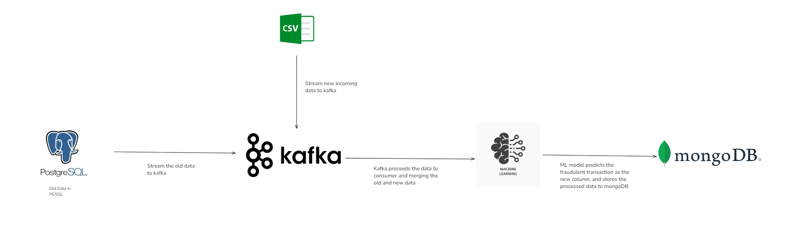
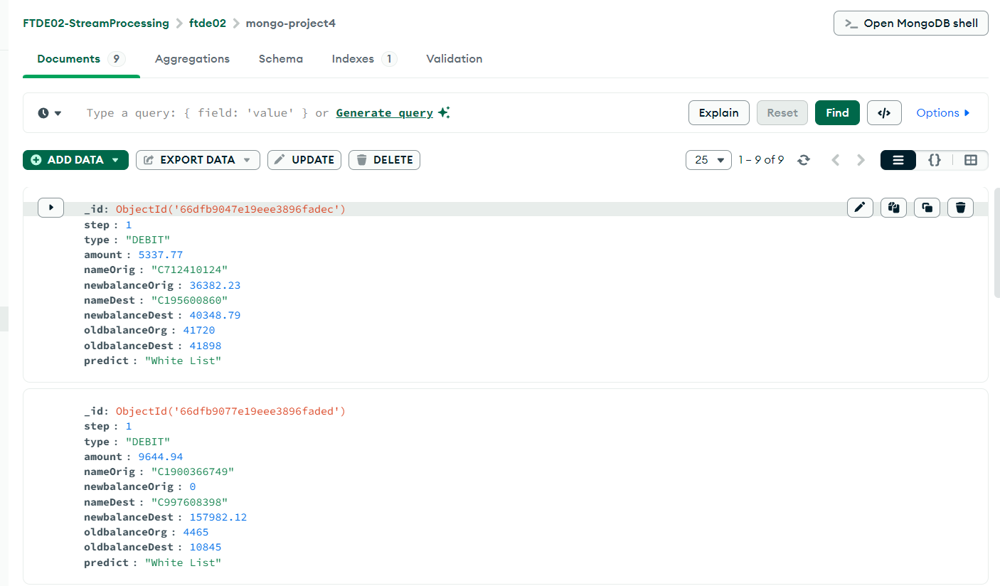

# Stream Processing with Apache Kafka, mongodb and postgresql

## Pipeline Graph

## Pipeline Components
- Postgresql : Storing old data
- Mongodb : Storing new processed data with machine learning model
- Kafka : Streaming data from postgresql to mongodb

## How does it work?
1. Postgresql will be the source of data
2. Kafka will stream data from postgresql
3. Kafka consumer will process it using machine learning model
4. Kafka will stream the processed data to mongodb

## Example of processed data in mongoDB

## Future Improvements
- Importing data from mongoDB to google sheets and creating a dashboard for visualization with google data studio/looker
